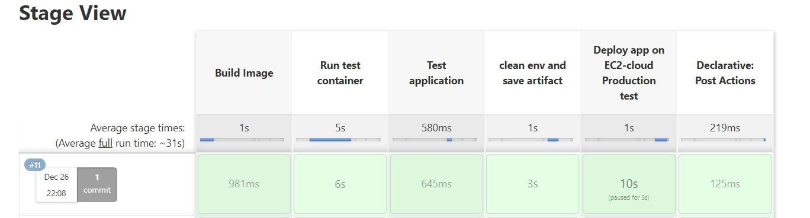
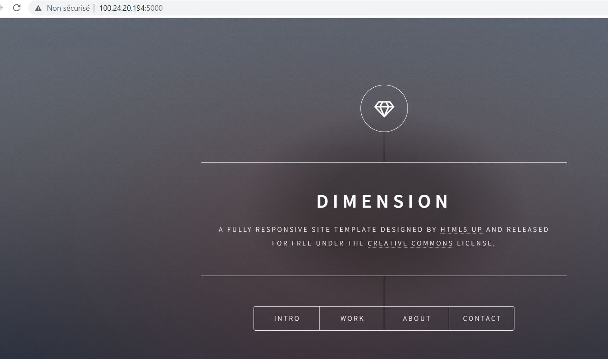
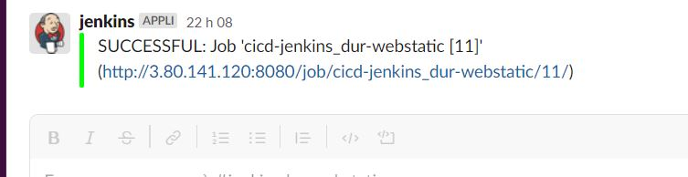
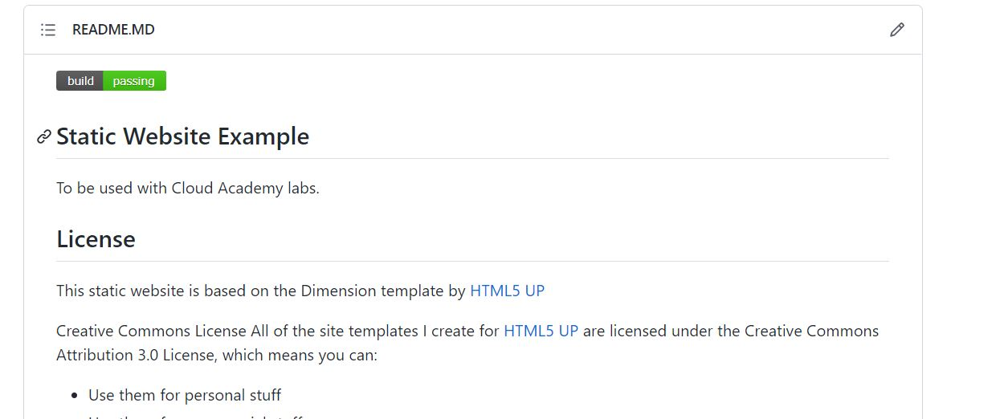

# RAHMANI Abdelkader
## Mini_projet Jenkins
----------------------------------------------
 ### Instructions:

https://github.com/diranetafen/static-website-example.git
1) Forkez ce repo afin d’en disposer librement
2) Créer un fichier Dockerfile permettant de conteneuriser cette application
3) Déployez un serveur Jenkins (from scratch) et non à l’aide de docker sur une instance AWS ec2 
(https://www.digitalocean.com/community/tutorials/how-to-install-jenkins-on-ubuntu-20-04-fr )
4) Créez un jenkinsfile permettant de builder tester et déployer automatiquement cette application 
sur une machine cloud Ec2 (prenom-ec2-prod).
5) Réalisez dans votre pipeline le test de bon fonctionnement de votre application une fois celle-ci 
déployée en environnement de prod (Ec2-cloud) 
6) Réalisez des différentes notifications de fin de build vers Github et aussi vers votre slack (créer un 
channel ynov-project-jenkins). NB: Utilisez un code avec structure conditionnelle pour les 
notifications, comme celui utilisé dans la shared Library mais cette fois-ci sans utiliser de shared 
library, le code devra être saisi en dur dans votre Jenkinsfile.
7) Rédigez un rapport décrivant entièrement les actions réalisées avec capture d’écran que vous 
sauvegarderez dans l’intranet partagé de l’établissement.
--------------------------------------

# Utilisation jenkins pour CICD

# Installation de Jenkins server: 

* par docker docker (dirane)
* sinon installation en dur (documentation officiel)

Nous avons plusieurs possibilités d'infrastructures possibles:

1) une machine : pour server jenkins ( qui permet de builder et tester en utilisant un agent any ou agent docker, et on deploit sur cloud (heroku)
2) deux machines : une première machine pour server jenkins ( qui permet de builder et tester en utilisant un agent any ou agent docker, et on deploit sur la deuxieme machine prod 

ou bien deux machines : une première machine pour server jenkins qui va envoyer les taches en ssh  et les executer sur la deuxieme machine : builder et tester en utilisant un agent any ou agent docker, et on deploit sur cette deuxieme machine prod (cette possibilité n'a pas fonctionné dans notre cas, car pour builder il faut le dockerfile sur la machine et toutes les ressources necessaires pour builder l'image: docker build -t image_name .)


Dans ce cas de mini_projet, j'ai opté alors pour la deuxième possibilité c.à.d deux machines, une pour jenkins et une deuxieme pour production.

Je clone le prjet de Dirane en local
git clone https://github.com/diranetafen/static-website-example.git

je crée un repo sur mon compte github et on push le projet cloné
```
git remote set-url origin https://github.com/kader9090/webstatic_jenkins_dur.git
git remote -v
git push -u origin main
```
----------------


# machine1: kader-ec2-prod: ubuntu 20.04 lts, t2.micro, SSD 20 Go, securité groupe : 22/8080:interface Jenkins/80 :siteweb

script:
bash
```
#!/bin/bash
curl -fsSL https://get.docker.com -o get-docker.sh
sh get-docker.sh
sudo usermod -aG docker ubuntu
```
je me connecte en ssh sur la machine prod pour vérifier si docker est bien installé:
```
docker --version => Docker version 20.10.12, build e91ed57 => docker est bien installé
```

pour vérifier que curl est bien présent sur la machine (ça sera utilisé pour l'acceptation dans le jenkinsfile)

```
curl --version => curl 7.68.0 (x86_64-pc-linux-gnu) libcurl/7.68.0 OpenSSL/1.1.1f zlib/1.2.11 brotli/1.0.7 libidn2/2.2.0 libpsl/0.21.0 (+libidn2/2.2.0) libssh/0.9.3/openssl/zlib nghttp2/1.40.0 librtmp/2.3
Release-Date: 2020-01-08
```
 

# Installation de Jenkins:
## machine2:kader-ec2-jenkins : ubuntu 20.04 lts, t2.large, SSD 20 Go, securité groupe : 22/8080:interface Jenkins

# Procédure :

```
Déployez un serveur Jenkins (from scratch) et non à l’aide de docker sur une instance AWS ec2 
(https://www.digitalocean.com/community/tutorials how-to-install-jenkins-on-ubuntu-20-04-fr )

sudo apt install default-jre
java --version => 

openjdk version "11.0.13" 2021-10-19
OpenJDK Runtime Environment (build 11.0.13+8-Ubuntu-0ubuntu1.20.04)
OpenJDK 64-Bit Server VM (build 11.0.13+8-Ubuntu-0ubuntu1.20.04, mixed mode)

sudo apt install jenkins -y
sudo systemctl start jenkins
sudo systemctl status jenkins
```


```
sudo ufw allow 8080  =>

Rules updated
Rules updated (v6)

sudo ufw status

Status: inactive

# Installation Docker

curl -fsSL https://get.docker.com -o get-docker.sh
sh get-docker.sh
sudo usermod -aG docker ubuntu
sudo usermod -aG docker jenkins
```
# Configuration de Jenkins

http://3.80.141.120:8080/


# Récupération du mot de passe pour configurer en graphoque Jenkins:

```
sudo cat /var/lib/jenkins/secrets/initialAdminPassword
```


on installe les plugins suggérés et on crée un utilisateur

créer un nouveau job => Pipeline 

je configure le projet pipeline, 
GitHub project: https://github.com/kader9090/webstatic_jenkins_dur.git/
Build Triggers: GitHub hook trigger for GITScm polling
Pipeline: regardes capture


--------------------------------------

# ajouter des credentials: 

token github: de type texte secret
 * Global
    * Nom : kader9090
    * MDP : ghp_j.........
    * ID  : github_password
    * descritpion  : github_password


* Docker Hub : de type texte secret
    * Global
    * Nom : abdelkader90
    * MDP : cefbd13............
    * ID  : dockerhub_password

* clé SSH pour Production :
    * SSH Username with private key
    * ID : kader_ec2_private_key
    * Username : ubuntu
    * Private key : celle qu'on utilise pour se connecter sur nos machines AWS
-----------------------------------


# ajouter des plugins:

*Github Intégration
Administrer Jenkins → Plugin → Installer GitHub Integration

configuration du webhook sur le github
[ GitHub ] : Projet → Settings → add webhook

payload url:
@ip de server jenkins:8080/github-webhook/


on teste le lien webhook comme indiqué sur cette capture:


*embedaable-build-status
[ Jenkins ] → Administrer Jenkins → Plugin → Embeddable-build-status

ajouter le github build status dans le README.md
[ Jenkins ] → cicd-jenkins_dur-webstatic → Embeddable Build Status → Links / Markdown / unprotected=> je copie le lien unprotected et je colle sur le README.md sur vscode.


*slack notification Plugin
[ Jenkins ] → Administrer Jenkins → Plugin → Slack Notification Plugin

sur slack:
    * Création d'un nouveau canal : jenkinsdur_webstat
    * Propriétés ==> Intégration ==> Application ==> Ajouter une application
        * choisir Jenkins ==> configuration
        * Ajouter à Slack
        * Publier dans le canal : jenkinsdur_webstat
        * Ajouter
        * Récupérer les données :
        * canal : #jenkinsdur_webstat
Sous-domaine de l’équipe: ajc-devops-siege
Identifiant d’authentification du jeton d’intégration: Hm7tGw2JjRajIxPCmQCOHgXV

* Enregistrer les paramètres


configuration de slack sur Jenkins 
sur jenkins: configurer le systeme=> slack => créer credential =>ajouter credential de type secret texte

workspace: ajc-devops-siege (Sous-domaine de l’équipe)
le canal :jenkinsdur-webstatic


le test de connexion est reussi

# Dockerfile:

```
FROM nginx
COPY ./ /usr/share/nginx/html
```

# Jenkinsfile

Maintenant que la configuration de l'environnement est terminée, on écrit le Jenkinsfile:

```
pipeline {

    environment {
        IMAGE_NAME = "static-web"
        USERNAME = "abdelkader90"
        CONTAINER_NAME = "static-web"
        EC2_PRODUCTION_HOST = "100.24.20.194"

    }

    agent none

        stages{

            stage ('Build Image'){
            agent any
                steps {
                    script{
                         sh 'docker build -t $USERNAME/$IMAGE_NAME:$BUILD_TAG .'
               }
           }
       }

       stage ('Run test container') {
           agent any
           steps {
               script{
                   sh '''
                       docker stop $CONTAINER_NAME || true
                       docker rm $CONTAINER_NAME || true
                       docker run --name $CONTAINER_NAME -d -p 5000:80 $USERNAME/$IMAGE_NAME:$BUILD_TAG
                       sleep 5
                   '''
               }
           }
       }

       stage ('Test application') {
           agent any
           steps {
               script{
                   sh '''
                       curl http://localhost:5000 | grep -iq "Dimension"
                   '''
               }
           }
       }

       stage ('clean env and save artifact') {
           agent any
           environment{
               PASSWORD = credentials('dockerhub_password')
           }
           steps {
               script{
                   sh '''
                       docker login -u $USERNAME -p $PASSWORD
                       docker push $USERNAME/$IMAGE_NAME:$BUILD_TAG
                       docker stop $CONTAINER_NAME || true
                       docker rm $CONTAINER_NAME || true
                       docker rmi $USERNAME/$IMAGE_NAME:$BUILD_TAG
                   '''
               }
           }
       }
                
        stage('Deploy app on EC2-cloud Production test') {
            agent any
            when{
                expression{ GIT_BRANCH == 'origin/master'}
            }
            steps{
                withCredentials([sshUserPrivateKey(credentialsId: "kader_ec2_private_key", keyFileVariable: 'keyfile', usernameVariable: 'NUSER')]) {
                    catchError(buildResult: 'SUCCESS', stageResult: 'FAILURE') {
                        script{
                            timeout(time: 15, unit: "MINUTES") {
                                input message: 'Do you want to approve the deploy in production?', ok: 'Yes'
                            }						
                            sh'''                              
                                ssh -o StrictHostKeyChecking=no -i ${keyfile} ${NUSER}@${EC2_PRODUCTION_HOST} docker stop $CONTAINER_NAME || true
                                ssh -o StrictHostKeyChecking=no -i ${keyfile} ${NUSER}@${EC2_PRODUCTION_HOST} docker rm $CONTAINER_NAME || true
                                ssh -o StrictHostKeyChecking=no -i ${keyfile} ${NUSER}@${EC2_PRODUCTION_HOST} docker rmi $USERNAME/$IMAGE_NAME:$BUILD_TAG || true
                                ssh -o StrictHostKeyChecking=no -i ${keyfile} ${NUSER}@${EC2_PRODUCTION_HOST} docker run --name $CONTAINER_NAME -d -p 5000:80 $USERNAME/$IMAGE_NAME:$BUILD_TAG
                            '''
                        }
                    }
                }
            }
        }


    }

    post {
        success{
            slackSend (color: '#00FF00', message: "SUCCESSFUL: Job '${env.JOB_NAME} [${env.BUILD_NUMBER}]' (${env.BUILD_URL})")
        }
        failure {
            slackSend (color: '#FF0000', message: "FAILED: Job '${env.JOB_NAME} [${env.BUILD_NUMBER}]' (${env.BUILD_URL})")
        }
    }

}


```






Pipeline fonctionne, et le webstatic est bien déployé.